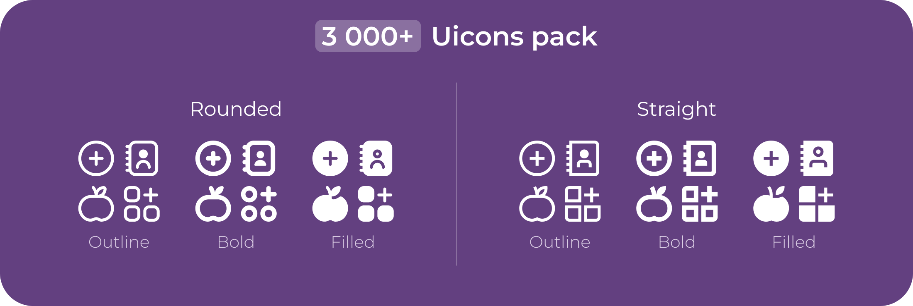

<p align="middle">
    
</p>

# Icons
[](https://maven-badges.herokuapp.com/maven-central/lol.hostov.icons)

This is a Jetpack Multiplatform icons pack with 498 straight and rounded icons.

### Install:

```
# for rounded icons pack
icons = { module = "lol.hostov.icons:rounded", version = "1.0.0" }

# for straight icons pack
icons = { module = "lol.hostov.icons:straight", version = "1.0.0" }
```

### Usage example:
```
// import me.localx.icons.rounded.Icons
// import me.localx.icons.rounded.outline.Check

Icon(
    painter = rememberVectorPainter(Icons.Outline.Check) 
    contentDescription = null,
    modifier = Modifier.size(56.dp),
    tint = Color.Red
)
```

For more icon examples see the <a href="https://localhostov.github.io/icons/">website</a>

### Source
Uicons by <a href="https://flaticon.com/uicons">Flaticon</a>

Figma: https://www.figma.com/community/file/1269054621208767211/250-icon-pack